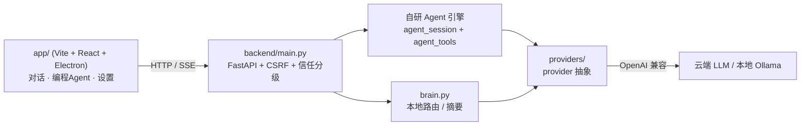

# Cogito

> 一个从零手写的本地 AI agent —— 自研 agent 循环 + 工具系统 + provider 抽象,**不依赖任何 agent 框架**(无 LangChain / LangGraph / Dify)。
>
> *A local AI agent built from scratch: hand-written agent loop, tool system, and provider abstraction — zero agent frameworks.*

**Cogito**(拉丁语"我思")是一个跑在本机的 AI 助手:既能日常对话,也能作为**编程 Agent** 在你的代码仓库里读写文件、执行命令、自动打 git 检查点并一键回滚。它的核心——agent 循环、工具调用、多模型 provider 抽象——**全部手写**,用来证明"我能从零搭出一个 agent,而不是调一个库"。

> ⚙️ **状态:自研引擎版 · 归档作品。** 这是作者在切换到第三方内核**之前**的自研版本,复活并打磨成独立作品。它能完整运行,定位是"展示从零实力 + 吃透 LLM 底层"的作品集项目,而非长期维护的产品。

## 亮点

- 🔁 **手写 Agent 循环(ReAct)** —— 思考 → 调工具 → 观察 → 再思考的状态机;逐工具执行、**高危操作执行前暂停确认**、会话持久化(后端重启可续跑)。→ [`backend/agent_session.py`](backend/agent_session.py)
- 🛠️ **工具系统 + 作用域护栏** —— 读/列/搜/改/删/跑命令/git;所有路径强制落在授权白名单内(防目录穿越),只读自动执行、改动类高危确认。→ [`backend/agent_tools.py`](backend/agent_tools.py)
- 🔌 **多 provider 抽象** —— 统一 OpenAI 兼容接口,**流式**(逐 token + 思考流)与 **function-calling** 两条路;DeepSeek / Ollama / 任意 OpenAI 兼容端点。→ [`backend/providers/`](backend/providers/)
- 🧠 **本地模型"大脑"** —— 用本地小模型(Ollama)做任务路由(简单问题本地直答,复杂的派给云端)与长对话滚动摘要——上下文窗口管理的活教材。→ [`backend/brain.py`](backend/brain.py)
- 🛡️ **git 安全网** —— 编程 Agent 每次任务开始打检查点,改坏了一键回滚到起点。
- 🔐 **信任分级 + 权限矩阵** —— 本机全功能 / 远程受限(远程禁 Agent、文件读写、密钥),后端强制、不靠前端隐藏。→ [`backend/security.py`](backend/security.py)

## 架构



## 快速开始(Windows)

需要 **Python 3.11+**、**Node 18+**、**Git**。

```powershell
# 后端
python -m venv backend\.venv
backend\.venv\Scripts\python -m pip install -r backend\requirements.txt
backend\.venv\Scripts\python backend\main.py        # 起在 http://127.0.0.1:8756

# 前端(另开一个终端)
cd app
npm install
npm run dev                                          # Electron 窗口会自动拉起后端
```

随后在界面「API 管理」里填一个 API key(默认 DeepSeek,也可改成任意 OpenAI 兼容端点),即可开始对话。编程 Agent 模式需要把工作目录设为一个 git 仓库(它要 git 做安全网)。

## 它"不是"什么

- **不是**某框架的封装 —— agent 循环是手写的,这正是本项目的全部价值。
- **不含** VPN、一键上传 GitHub 等外围 —— 已精简,聚焦 对话 + 编程Agent + 设置。
- **不假装**在长期迭代 —— 见上方"归档作品"说明。

## 技术栈

**后端** FastAPI · httpx · 自研 agent 引擎  |  **前端** React 18 · Vite 6 · Electron 33 · TypeScript

## 路线(进行中)

- [ ] 把核心引擎(`agent_session` + `agent_tools` + `providers`)抽成一个干净、可安装的库
- [ ] `docs/llm-basics/`:把"大模型基本原理"(推理 API / token 与上下文 / 采样解码 / tool-calling / ReAct / 流式 / RAG / 多 provider)逐条挂到本项目的代码实现上

---

作者 **Lenssansi** · 基于 [MIT License](LICENSE) 开源
