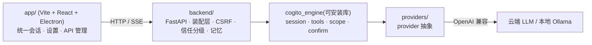

# Cogito

> 一个从零手写的本地 AI agent —— 自研 agent 循环 + 工具系统 + provider 抽象 + 跨会话记忆,**不依赖任何 agent 框架**(无 LangChain / LangGraph / Dify)。
>
> *A local AI agent built from scratch: hand-written ReAct loop, tool system, provider abstraction, and a cross-session memory mechanism — zero agent frameworks.*


**Cogito**(拉丁语"我思")是一个跑在本机的 AI 助手 + 编程 Agent:以一个项目根目录为工作基地,能读写文件、执行命令、联网搜索、自动打 git 检查点并一键回滚,还带一套**会自己学、自己写、自己用**的跨会话记忆。它的核心——agent 循环、工具调用、多模型 provider 抽象、记忆机制——**全部手写**,用来证明"我能从零搭出一个 agent,而不是调一个库"。

> ⚙️ **状态:自研引擎版 · 作品集项目。** 定位是"展示从零实力 + 吃透 LLM 底层",能完整运行;核心引擎已抽成可独立安装的库(见 [`engine/`](engine/))。

## 目录

- [亮点](#亮点)
- [记忆机制](#记忆机制)
- [架构](#架构)
- [快速开始](#快速开始)
- [测试](#测试)
- [项目结构](#项目结构)
- [技术栈](#技术栈)
- [路线](#路线)
- [致谢](#致谢)

## 亮点

- 🔁 **手写 Agent 循环(ReAct)** —— 思考 → 调工具 → 观察 → 再思考的状态机;逐工具执行、**高危操作执行前暂停确认**(两态:断开式续跑 / 单流回调)、可取消、会话持久化(后端重启可续跑)。→ [`engine/cogito_engine/session.py`](engine/cogito_engine/session.py)
- 🛠️ **工具系统 + 作用域护栏** —— 读/列/搜/改/删/跑命令/git/联网搜索;一套工具,边界差异全由注入的 Scope 决定;路径强制落在授权范围(防目录穿越),读自由、写/删/命令在根目录外永远确认。→ [`engine/cogito_engine/tools.py`](engine/cogito_engine/tools.py)
- 🔌 **多 provider 抽象** —— 统一 OpenAI 兼容接口,**流式**(逐 token + 思考流)与 **function-calling** 两条路;DeepSeek / Ollama / 任意 OpenAI 兼容端点。→ [`engine/cogito_engine/providers/`](engine/cogito_engine/providers/)
- 🧠 **跨会话记忆机制** —— 结构化文件 + 小模型选择,不用向量数据库;静态层(分层 `COGITO.md` 常驻指令)+ 动态层(每项目记忆库 + 相关性召回 + 时间感知 + 每轮自动提炼)。见[下一节](#记忆机制)。→ [`backend/memory.py`](backend/memory.py)
- 🛡️ **git 安全网** —— 改文件前自动打懒检查点(纯聊天不打),改坏了一键回滚(`reset --hard` + 清掉新建文件,且不动 gitignore 的私人文件)。
- 🔐 **信任分级 + 权限矩阵** —— 本机全功能 / 远程受限(远程禁 Agent、文件读写、密钥),后端强制 + CSRF,不靠前端隐藏。→ [`backend/security.py`](backend/security.py)
- 📦 **引擎已抽成可安装库** —— `cogito_engine`(协议 + 默认实现 + 护栏)对应用零依赖、靠依赖注入,可被任意宿主复用。→ [`engine/`](engine/)

## 记忆机制

Cogito 的特色:一套**不靠向量数据库、纯用结构化文件 + 小模型选择**的记忆系统(设计对照 Claude Code,见[致谢](#致谢))。分两层并行工作。

**静态层(声明式,常驻)** —— 分层的 `COGITO.md` 指令,启动时按 广→窄 **拼接**进系统提示:

- 管理策略 / 用户全局(`~/.cogito/COGITO.md`)/ 项目根(`COGITO.md`)/ 项目私有(`COGITO.local.md`,gitignore)
- 子目录 `COGITO.md` 与 `.cogito/rules/*.md`(带 `paths:` glob 的条件规则)按"读到该目录文件时"懒加载
- `@import` 内联引用其他文件;索引行 + 字节双截断,防长行索引撑爆上下文

**动态层(学习式,自动)** —— 每项目一个记忆库 `~/.cogito/projects/<slug>/memory/`:

- 每条记忆 = 一个 `.md` + frontmatter(`name` / `description` / `type` / 日期),四种类型 `user` / `feedback` / `project` / `reference`,**强制分类决策**(`feedback`/`project` 必带 Why + How to apply)
- `MEMORY.md` **索引常驻**系统提示,正文**按需**取(`memory_read`)
- **召回**:把索引(name—description)发给**小模型挑相关的**(宁少勿错),不用 embedding;无 key / 超时 / 解析失败自动退回关键词召回
- **时间感知**:召回时 ≥2 天的记忆自动加 stale 警告,逼模型用前核实(grep 路径/函数、读当前文件),防"权威的错误"
- **每轮自动提炼**:对话结束后台抽取该记的事、去重落库——让**任何模型**(不止强模型)都能自建记忆

实现见 [`backend/memory.py`](backend/memory.py) 与 [`backend/memory_extract.py`](backend/memory_extract.py) 顶部说明。

## 架构



引擎(`engine/`)是抽离的可安装库,后端(`backend/`)是把它接到本应用的装配层。详见[开发文档](docs/DEVELOPMENT.md)。

## 快速开始

需要 **Python 3.11+**、**Node 18+**、**Git**(目前面向 **Windows**)。

```powershell
# 首次安装
python -m venv backend\.venv
backend\.venv\Scripts\python -m pip install -r backend\requirements.txt   # 含 -e ../engine
cd app; npm install

# 启动(双击 start-dev.bat,或:)
cd app; npm run dev
```

`npm run dev` 下 Electron 作为唯一进程主,**自举**后端 + Vite(开发端口运行时动态分配,不与别的项目撞口),就绪后开窗。随后在「API 管理」填一个 API key(DeepSeek / 本机 Ollama / 任意 OpenAI 兼容端点)即可开始。更多见[开发文档](docs/DEVELOPMENT.md)。

## 测试

```powershell
backend\.venv\Scripts\python -m pip install pytest
backend\.venv\Scripts\python -m pytest engine\tests -q    # 引擎(全离线,脚本化假 provider)
backend\.venv\Scripts\python -m pytest backend\tests -q   # 后端(记忆 / 提炼 / CSRF)
cd app; npx tsc --noEmit                                   # 前端类型检查
```

## 项目结构

```
engine/   可安装的 agent 引擎库 cogito_engine(协议 + 默认实现 + 护栏 + 测试)
backend/  装配层:FastAPI + 把引擎接到本应用 + 配置 / 记忆 / 安全
app/      前端:Vite + React + TypeScript + Electron(统一会话 / 设置 / API 管理)
docs/     文档(开发文档、git 速查)
```

详见[开发文档](docs/DEVELOPMENT.md)。

## 技术栈

**引擎/后端** Python 3.11 · FastAPI · httpx · 自研 agent 引擎(`cogito_engine`)  |  **前端** React 18 · Vite 6 · Electron 33 · TypeScript

## 路线

- [x] 把核心引擎抽成干净、可安装的库 → [`engine/`](engine/)
- [x] 跨会话记忆机制(静态层 + 动态层 + 自动提炼)→ [`backend/memory.py`](backend/memory.py)
- [ ] `docs/llm-basics/`:把"大模型基本原理"(推理 API / token 与上下文 / 采样解码 / tool-calling / ReAct / 流式 / RAG / 多 provider)逐条挂到本项目的代码实现上

## 致谢

- **记忆机制**的设计对照了 [Claude Code](https://www.anthropic.com/claude-code) 的两层记忆(静态 `CLAUDE.md` + 自动记忆),用结构化文件 + 小模型选择复刻其思路。
- agent 循环、工具系统、provider 抽象均为从零手写,刻意**不依赖** LangChain / LangGraph / Dify —— 这正是本项目的全部价值。

---

作者 **Lenssansi** · 基于 [MIT License](LICENSE) 开源
